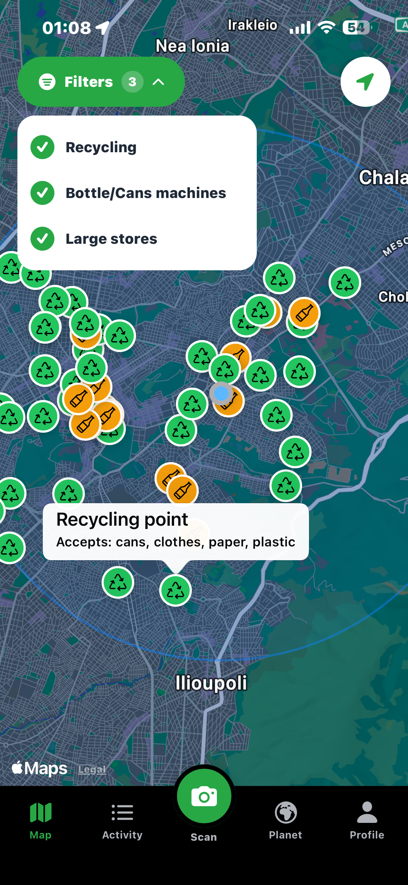
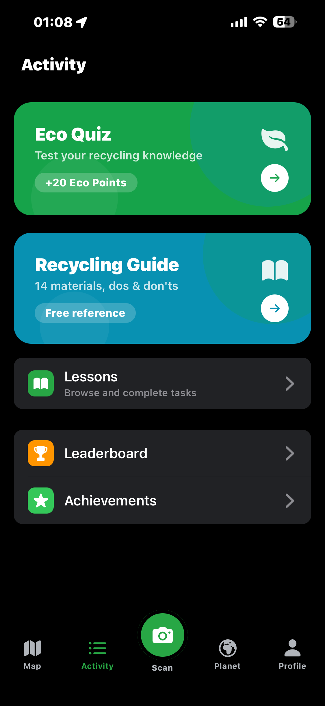
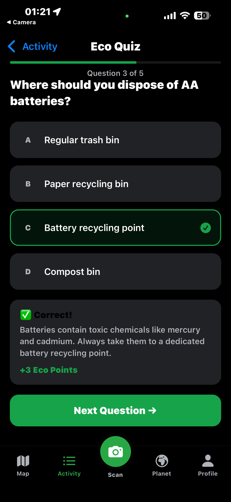
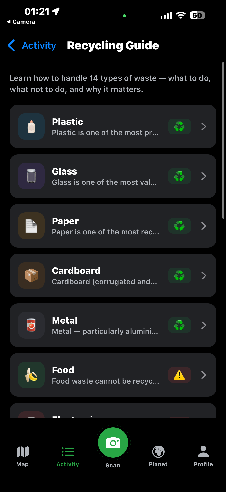
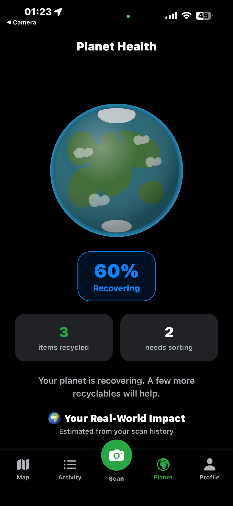
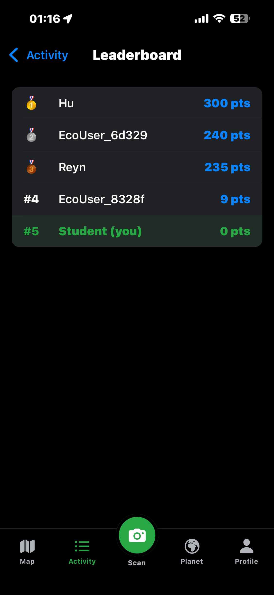
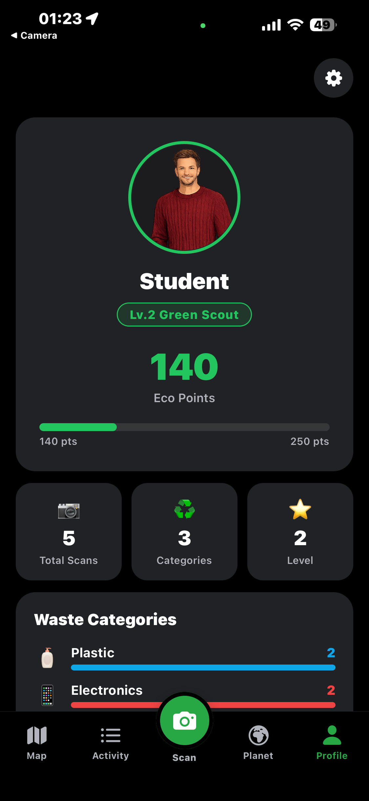

# EcoScan

EcoScan is an Expo-based mobile app for learning how to sort waste, find nearby recycling locations, and turn everyday items into something useful again.

The app combines scanning, local educational content, map-based discovery, and profile gamification. It is designed to help users make better recycling decisions in real time while tracking progress over time.

## Screenshots

|                              Map                               |                                 Activity                                 |                                 Eco Quiz                                 |                                    Recycling Guide                                     |
| :------------------------------------------------------------: | :----------------------------------------------------------------------: | :----------------------------------------------------------------------: | :------------------------------------------------------------------------------------: |
|  |  |  |  |

|                                   Planet Health                                    |                                  Leaderboard                                   |                                Profile                                 |
| :--------------------------------------------------------------------------------: | :----------------------------------------------------------------------------: | :--------------------------------------------------------------------: |
|  |  |  |

## What the app does

- Scans everyday objects and suggests a waste category, recycling advice, and upcycling ideas.
- Shows nearby recycling points, bottle/can return machines, and large stores on a map.
- Provides a learning hub with eco facts, recycling rules, and upcycling inspiration.
- Tracks eco points, scan history, streaks, category stats, and achievement progress.
- Supports onboarding and profile setup before entering the main app.
- Includes lesson features for school and teacher workflows backed by Supabase.

## Main screens

- Map: discovers nearby recycling-related locations using device location.
- Scan: classifies items and returns recycling guidance plus upcycling suggestions.
- Learn: presents curated facts, sorting rules, and reuse ideas.
- Activity: shows recent scan activity and progress.
- Planet: environmental progress and impact views.
- Profile: level, points, scan history, and achievements.
- Settings: app and account options.

## Tech stack

- Expo and React Native
- Expo Router for file-based navigation
- TypeScript
- Supabase for auth and remote data sync
- AsyncStorage for offline/local persistence
- react-native-maps and expo-location for map features
- expo-camera for scanning
- react-native-reanimated for UI motion

## Data and services

- Local profile and scan data are cached on device.
- Supabase is used for sign-in and syncing profiles, lessons, and scan history.
- Upcycling ideas can fall back to built-in suggestions when no Gemini key is configured.
- The app can still function offline for several flows using local storage.

## Project structure

- src/app: route screens and navigation entry points
- src/components: reusable UI components
- src/contexts: app state providers such as profile state
- src/data: static eco learning content
- src/services: storage, profile, lessons, quiz, map, and AI helpers
- src/hooks: theme and color-scheme helpers
- src/constants: shared theme values

## Getting started

1. Install dependencies

   npm install

2. Start the app

   npx expo start

You can then open the app in Expo Go, an emulator, or a development build.

## Notes

- The default route redirects to the map screen.
- The app uses file-based routing under src/app.
- Some features depend on location and camera permissions.
- Optional Gemini support can be enabled with EXPO_PUBLIC_GEMINI_API_KEY.

## Resetting the starter content

If you want to restore the generated starter layout, run:

npm run reset-project

This moves the current starter files into app-example and recreates a blank app directory.

# Welcome to your Expo app 👋

This is an [Expo](https://expo.dev) project created with [`create-expo-app`](https://www.npmjs.com/package/create-expo-app).

## Get started

1. Install dependencies

   ```bash
   npm install
   ```

2. Start the app

   ```bash
   npx expo start
   ```

In the output, you'll find options to open the app in a

- [development build](https://docs.expo.dev/develop/development-builds/introduction/)
- [Android emulator](https://docs.expo.dev/workflow/android-studio-emulator/)
- [iOS simulator](https://docs.expo.dev/workflow/ios-simulator/)
- [Expo Go](https://expo.dev/go), a limited sandbox for trying out app development with Expo

You can start developing by editing the files inside the **app** directory. This project uses [file-based routing](https://docs.expo.dev/router/introduction).

## Get a fresh project

When you're ready, run:

```bash
npm run reset-project
```

This command will move the starter code to the **app-example** directory and create a blank **app** directory where you can start developing.

### Other setup steps

- To set up ESLint for linting, run `npx expo lint`, or follow our guide on ["Using ESLint and Prettier"](https://docs.expo.dev/guides/using-eslint/)
- If you'd like to set up unit testing, follow our guide on ["Unit Testing with Jest"](https://docs.expo.dev/develop/unit-testing/)
- Learn more about the TypeScript setup in this template in our guide on ["Using TypeScript"](https://docs.expo.dev/guides/typescript/)

## Learn more

To learn more about developing your project with Expo, look at the following resources:

- [Expo documentation](https://docs.expo.dev/): Learn fundamentals, or go into advanced topics with our [guides](https://docs.expo.dev/guides).
- [Learn Expo tutorial](https://docs.expo.dev/tutorial/introduction/): Follow a step-by-step tutorial where you'll create a project that runs on Android, iOS, and the web.

## Join the community

Join our community of developers creating universal apps.

- [Expo on GitHub](https://github.com/expo/expo): View our open source platform and contribute.
- [Discord community](https://chat.expo.dev): Chat with Expo users and ask questions.
